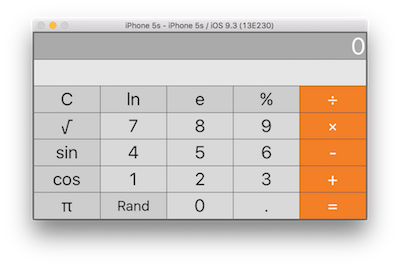
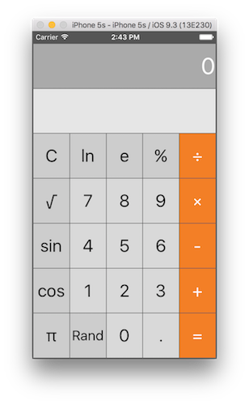

第一次作业：

*  1 demo √
* 2 floating number input √

需要考虑非legal的状况，比如：192.168.0.1，观察了一下Mac自带calculator的状况， 如果已经有了.则再输入.则被忽略

处理方式：

```
            if let pos = textCurrentIndisplay.rangeOfString("."){
                textCurrentIndisplay = textCurrentIndisplay.stringByReplacingOccurrencesOfString(".", withString: "", options: NSStringCompareOptions.LiteralSearch, range: pos.endIndex..<textCurrentIndisplay.endIndex)
            }
```

从第一个.开始开始，然后之后的.就替换成空,用的方法是:

``` 
func textCurrentIndisplay.stringByReplacingOccurrencesOfString(String, withString: String, options: NSStringCompareOptions, range: Range<Index>?)
```

* 3 more operations buttons 至少加起来12个 √
You can choose whatever operations appeal to you. 

加点喜欢的operation按钮.我加了 Rand, ln ,%, sin

ln/sin 可以直接带入 UnaryOperation, % 带入 BinaryOperation。
Random 代入 Constant 不对，每次都一样，所以为Random写一个单独的Random


* 4 The buttons must arrange themselves nicely in portrait and landscape modes on all iPhones , Use color to make your UI look nice √ Use color是做了，但是look nice好像并没有做到 






* 5 description String 
* 6 isPartialResult Bool
* 7 UILabel led to what is showing in the display
* 8 C button to clear √ 有待改进
