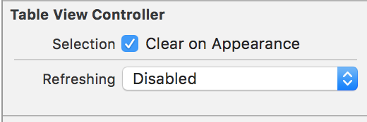

##lecture 9

#### Table View

其实对于UITableView之前已经了解了一些，许多iOS教程感觉都是从UITableView开始的。不过感觉Table View可能要被CollectionView取代了？


- DataSource 数据源
- Delegate 更多是展示和控制tableview的


然后对于UITableViewController也是小争议，因为之前看的很多人不建议用因为总的来说，它可能限制太多，现在流行的App，比如Airbnb，就明显是TabarView + TableView 来组合的.

取决想做怎样的App.


值得mark的地方有：

prepareForSegue


	func prepareForSegue(segue: UIStoryboardSegue, sender: AnyObject?) {
	      if let identifier = segue.identifier {
	          switch identifier {
	          case “XyzSegue”: // handle XyzSegue here
	          case “AbcSegue”:
	              if let cell = sender as? MyTableViewCell,
	                 let indexPath = tableView.indexPathForCell(cell),
	                 let seguedToMVC = segue.destinationViewController as? MyVC {
	                     seguedToMVC.publicAPI = data[indexPath.section][indexPath.row]
	              }
	          default: break
	} }
	}




This is sort of like “table view target/action” (only needed if you’re not segueing, of course) 


	func tableView(sender: UITableView, didSelectRowAtIndexPath indexPath: NSIndexPath) {
	// go do something based on information about my Model
	// corresponding to indexPath.row in indexPath.section
	// maybe directly update the Detail if I’m the Master in a split view?
	}


#### Demo



##### Model

有ViewController -> Model ?


见识到了array of array of tweets， 如Java 一样， array of array of string.
写法是这样的：

	var tweets = [Array<Tweet>]()

model用了didSet，就是一旦更改model里的数据，就reloadData.


**Workspace - a collection of projects**

**FrameWork - bulit for genreic iOS Device **


```

if let query = searchText where !query.isEmpty

```

where此处用于筛选



然后看一下searchForTweets的写法


```
private func searchForTweets(){
    if let request = twitterRequest {
        lastTwitterRequest = request
        request.fetchTweets{ [weak weakSelf = self] newTweets in
            dispatch_async(dispatch_get_main_queue()){
                if request == weakSelf?.lastTwitterRequest {
                    if !newTweets.isEmpty{
                        weakSelf?.tweets.insert(newTweets, atIndex: 0)
                    }
                }
            }
        }
    }
}
```


- 依旧用了上一周的dispatch_async，因为是异步获取tweets的的关系
- 用weakSelf 因为如果使用self，就会被保留在heap上，但是试想网络可能有search forever的状况产生，所以需要使用weakSelf，问题在于否则这个viewController一直被keep在heap上，即使我们做新的query?
- 使用lastTwitterRequest是因为正如上一节课的 imageViewController 一样，问题可能出现在，我们这个时候已经开始search别的twitter request了，但是返回的依旧是上一个，比如图片这个时候才接收回之前的结果，所以这里需要lastTwitterRequest这个变量先记住上次request的是啥，然后如果这个requst就是上次request的话，才insert，否则忽略结果

所以老师强调，关于asynchronous，记住两件事

- memory cycle, 所以需要weak
- take time， things may not be the same

	
##### View 相关

想要label多行需要把行数设定为0.

注意字体的选择：

- Tweeter : headline 属于user data
- Tweet Text ： body
- Created ： caption 1

stackview再度出关.

Tweet Text需要更多空间，所以把Tweeter 的 hugging priority 被调高，所以它被hugged。

这里忍不住复制了,它的使用方式是创造了一个public var Tweet，数据类型，然后所有updateUI的事情都这个TableViewCell来做的，而不是像之前，放在TableViewController的cellForRowAtIndexPath这个方法里面的.


```

import UIKit
import Twitter

class TweetTableViewCell: UITableViewCell {
    
    @IBOutlet weak var tweetScreenNameLabel: UILabel!
    @IBOutlet weak var tweetTextLabel: UILabel!
    @IBOutlet weak var tweetCreatedLabel: UILabel!
    @IBOutlet weak var tweetProfileImageView: UIImageView!
    
    
    var tweet : Twitter.Tweet? {
        didSet {
            updateUI()
        }
    }
    
    private func updateUI(){
        //reset any existing tweet information
        tweetTextLabel?.attributedText = nil
        tweetScreenNameLabel?.text = nil
        tweetProfileImageView?.image = nil
        tweetCreatedLabel?.text = nil
        
        
        //load new information from our tweet (if any)
        if let tweet = self.tweet{
            tweetTextLabel?.text = tweet.text
            if tweetTextLabel?.text != nil {
                for _ in tweet.media {
                    tweetTextLabel.text! += " 📷"
                }
            }
            
            tweetScreenNameLabel?.text = "\(tweet.user)" //tweet.user
            
            if let profileImageURL = tweet.user.profileImageURL {
                if let imageData = NSData(contentsOfURL : profileImageURL){ // blocks main thread!
                    tweetProfileImageView?.image = UIImage(data: imageData)
                }
            }
            
            let formatter = NSDateFormatter()
            if NSDate().timeIntervalSinceDate(tweet.created) > 24*60*60 {
                formatter.dateStyle = .ShortStyle
            } else {
                formatter.timeStyle = .ShortStyle
            }
            tweetCreatedLabel?.text = formatter.stringFromDate(tweet.created)
        }
    }
    
}

```

blocks main thread 那里是需要修正的.


在tableViewController里的viewDidLoad()来设定row height，让它自动推断

        tableView.estimatedRowHeight = tableView.rowHeight
        tableView.rowHeight = UITableViewAutomaticDimension
        

profileImage的问题跟之前一样，需要http.

##### Search


为了实现search功能，drag textField 而不是Label，然后需要等它strech out，变成TextView的header，placeholder里放好东西。


```
@IBOutlet weak var searchTextField: UITextField!{
    didSet{
        searchTextField.delegate = self
        searchTextField.text = searchText
    }
}
```


```
func textFieldShouldReturn(textField: UITextField) -> Bool {
    textField.resignFirstResponder()
    searchText = textField.text
    return true
}
 ```   
    
然后因为之前的设定，就可以完美的收官了.
第一个函数didSet就是指定了delegate，不过第二句我不是很懂，在干嘛？

第二个函数就是一点return，设定searchText.然后hide键盘.


开始胡乱学iOS的时候，接触到Label和UITextField就觉得不可思议，为什么label那么简单，而text field那么难，还要delegate啥的，究其根本， text field是输入，是变化，是View变化了然后我们需要通知controller通知model的.

所以会有delegate，而一旦有了这个，也就复杂起来了。

##### UIRefreshControl

看到老爷爷最后po在网站上的代码多了这个所以来试试吧.

首先对于tableViewController， 这个UIRefreshControl是标准配置.可以直接enable.



enable之后就View就多东西了.

然后简单的加了几行就解决问题了，神奇的存在.


然后不得不说老师的代码真是神奇的存在和模式，为什么那么一点可以做这么多事。

